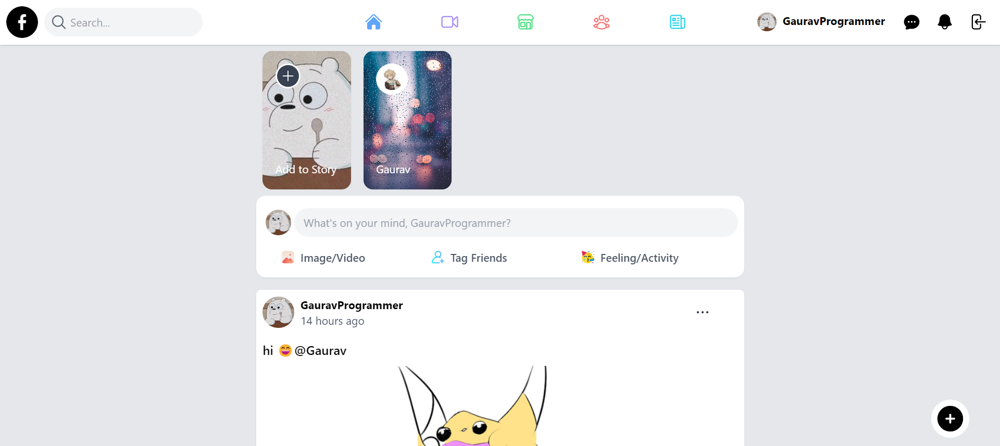
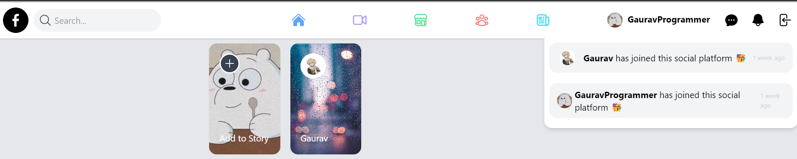
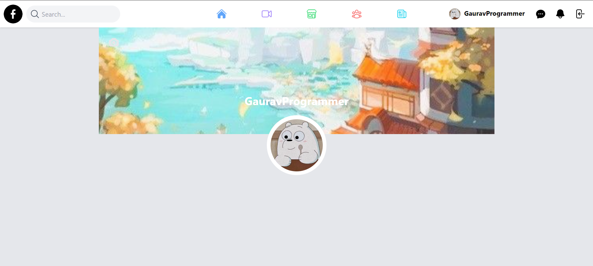
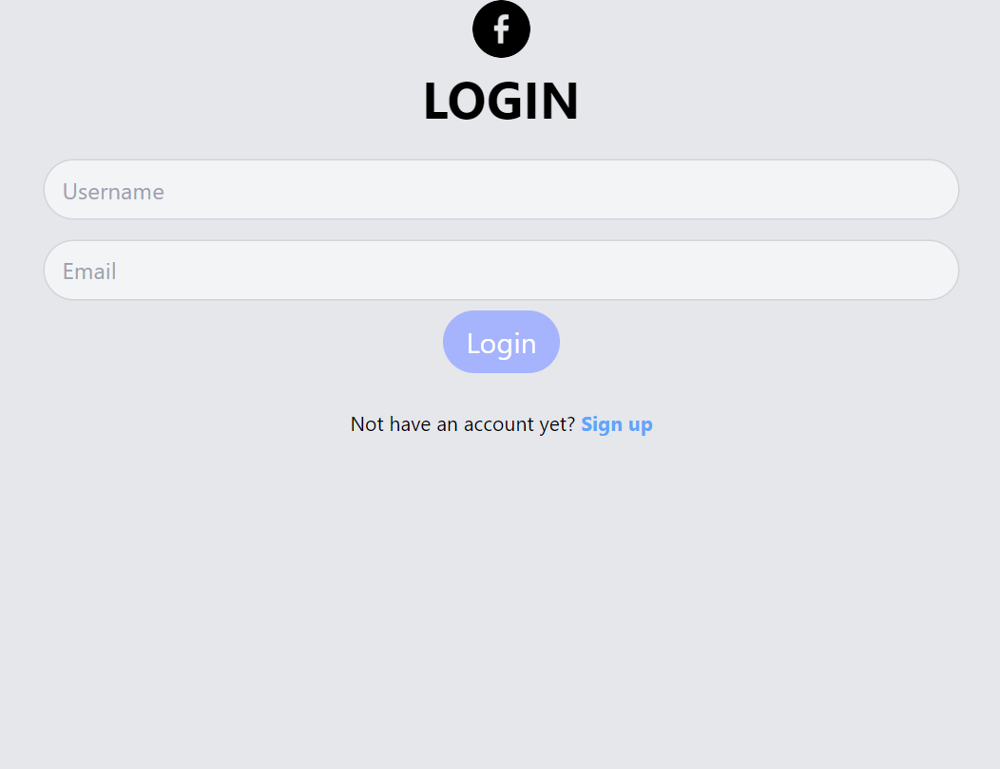
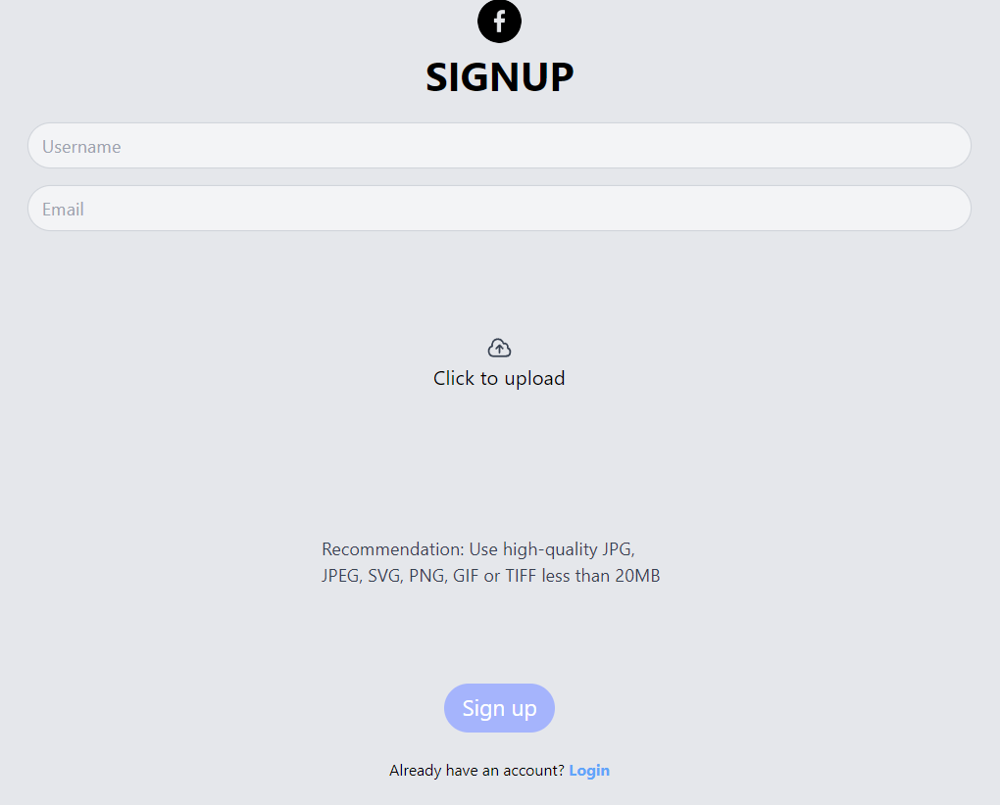

# Sanity Social App 
- live site : https://sanity-social-site.netlify.app/

## Screenshots

## Features ✨
- Login/Signup (with email username)
- Customizable bannerImage and profile Image
- Add Post / Delete Post
- Comment Feature
- Live Chat Feature
- Working Notifications
- Add Emoji Picker 🥳 
- Stories Section
- Working Search Filter

## Tech Stacks ⚙️
- Nextjs
- TailwindCss
- Sanity
- Emoji-picker
- javascript-time-ago
- Heroicons

# Feel free to contribute if you want You can add these features
- working like button
- create a profile page user other than logined user